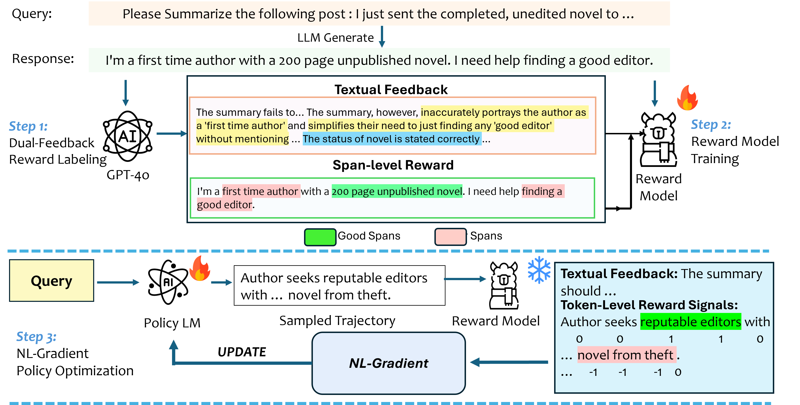

# Text2Grad: Reinforcement Learning from Natural Language Feedback

Text2Grad enables language models to learn from natural language feedback by converting text into gradient signals for model optimization.

## Abstract

Traditional RLHF uses coarse scalar rewards, masking detailed feedback and leading to opaque learning. Text2Grad converts free-form textual feedback into span-level gradients, aligning critiques with token spans to enable precise, targeted model improvements.

## Pipeline Overview



*Figure: The Text2Grad framework pipeline showing the flow from natural language feedback to gradient-based model optimization*

## Framework Components

Text2Grad consists of three main components:

1. **High-Quality Feedback Annotation Pipeline**: Pairs critiques with token spans for precise feedback alignment
2. **Fine-Grained Reward Model**: Predicts span-level rewards while generating explanatory critiques
3. **Span-Level Policy Optimizer**: Back-propagates natural-language gradients for targeted model improvements

## Key Features

- Natural language feedback processing for model training
- Token-level reward assignment from textual spans
- Support for multiple tasks:
  - Summarization
  - Code Generation
  - Question Answering
- Distributed training with DeepSpeed integration
- Flexible model architecture support

## Installation

```bash
# Clone the repository
git clone https://github.com/EdWangLoDaSc/Text2Grad-Reinforcement-Learning-from-Natural-Language-Feedback
cd Text2Grad-Reinforcement-Learning-from-Natural-Language-Feedback

# Install dependencies
bash env.sh
```

## Setting up OpenAI API Key
```bash
# Set your OpenAI API key as an environment variable
export OPENAI_API_KEY="your_api_key"
```

## Datasets

We utilize the following open-source datasets in our research:

### Code Generation
**KodCode**
- [KodCode-Light-RL-10K](https://huggingface.co/datasets/KodCode/KodCode-Light-RL-10K): Lightweight reinforcement learning dataset
- [KodCode-V1-SFT-4o](https://huggingface.co/datasets/KodCode/KodCode-V1-SFT-4o): Supervised fine-tuning dataset

### Question Answering
**UltraFeedback**
- [UltraFeedback-Binarized](https://huggingface.co/datasets/HuggingFaceH4/ultrafeedback_binarized): Binary feedback dataset for question-answering tasks

### Summarization
**SLF5K**
- [SLF5K Dataset](https://huggingface.co/datasets/JeremyAlain/SLF5K): Specialized dataset for summarization tasks

> **Note**: All datasets are publicly available on the HuggingFace Hub and are used in accordance with their respective licenses.

## Project Structure

```
/Text2Grad-Reinforcement-Learning-from-Natural-Language-Feedback/
├── rm_data_anno/                 # Reward Model Data Annotation
│   ├── kodCode/                  # Code Generation dataset processing
│   ├── slf5k/                    # Summarization dataset processing
│   └── ultrafeedback/            # Question Answering dataset processing
|
├── nl_reward_model/              # Natural Language Reward Model Implementation
│   ├── kodcode/                  # Code Generation reward model
│   ├── slf5k/                    # Summarization reward model
│   └── ultrafeedback/            # Question Answering reward model
|
├── nl_gradiant_policy_optimization/                  # Natural Language Gradient Implementation
│   ├── kodcode/                  # Code Generation training
│   ├── slf5k/                    # Summarization training
│   └── ultrafeedback/            # Question Answering training
```

## Usage

### 1. Data Annotation

The annotation pipeline processes raw text feedback into structured training dual-feedback reward data:

```bash
cd rm_data_anno/ultrafeedback
# For Question Answering tasks
python rm_data_anno/ultrafeedback/dual_feedback_annotation_RM.py \
    --data_path path/to/data
```

#### Input Data Formats for Dual-Feedback Annotation

#### 1.1 SLF5K Input JSON Format
```json
{
    "t3_132suw": {
        "generated_summary": "My girlfriend is premed and ...",
        "Post": "My girlfriend is studying something she won't ever use ..."
    }
}
```

#### 1.2 UltraFeedback Input JSON Format
```json
[
    {
        "prompt": "In this task, you are given ... \n\nA:",
        "prompt_id": "333685aaf217d34921dac65dbea023fe1180b5c1973dbb6554bc022d74b54e0c",
        "score_chosen": 4.0,
        "score_rejected": 4.0,
        "response": [
            {
                "content": "In this task, you are given ... \n\nA:",
                "role": "user"
            },
            {
                "content": "Could you provide ... ",
                "role": "assistant"
            }
        ],
        "is_chosen": true,
        "score": 4.0,
        "critique": ""
    }
]
```

#### 1.3 KodCode Input JSON Format
```json
[
    {
        "version": "v1.0",
        "style": "instruct",
        "subset": "Leetcode",
        "question_id": "Leetcode_36406_I",
        "question": "You are given a 0-indexed ...",
        "solution": "def max_height_diff_after_removal(heights):\n  ...",
        "test": "def test_max_height_diff_after_removal_all_equal():\n    assert max_height_diff_after_removal([3, 3, 3, 3]) == 0 ...",
        "gpt_pass_trial_num": 2,
        "gpt_difficulty": "hard",
        "gpt_pass_percentage": 0.2,
        "log": "..."
    }
]
```

### 2. Reward Model Training & Evaluation

#### 2.1 Training Reward Models

To train reward models for different tasks:

```bash
# Code Generation Task
cd nl_reward_model/kodcode
bash deepspeed_train_kodcode.sh

# Summarization Task
cd nl_reward_model/slf5k
bash deepspeed_train_slf5k.sh

# Question Answering Task
cd nl_reward_model/ultrafeedback
bash deepspeed_train_ultrafeedback.sh
```

#### 2.2 Evaluating Trained Models

Each dataset directory contains an `Evaluation` folder with scripts for model evaluation. Here's an example workflow for the KodCode dataset:

```bash
# Step 1: Navigate to evaluation directory
cd nl_reward_model/kodcode/evaluation

# Step 2: Merge LoRA weights with base model
python 1_merge_lora.py \
    --base_model "meta-llama/Llama-3.1-8B-Instruct" \
    --lora_model "../ckpt/llama31-8B-kodcode/0_4400" \
    --save_dir "../ckpt/llama31-8B-kodcode/0_4400_merge" \
    --merge_and_save True

# Step 3: Run inference on test dataset
python 2_infer.py \
    --model_path "../ckpt/llama31-8B-kodcode/0_4400_merge" \
    --dataset_path "../data/KodCode/kodcode_test.json" \
    --output_file "inference_results_0_4400.json" \
    --batch_size 40 \
    --prompt_max_length 1000 \
    --max_length 1600 \
    --max_new_tokens 350 \
    --gpu_ids "0,1" \
    --gpu_memory "30GiB"

# Step 4: Calculate evaluation metrics
python 3_metrics.py \
    --input_file "inference_results_0_4400.json" \
    --output_file "word_level_evaluation_results.json"
```

> **Note**: Remember to adjust file paths according to your setup before running the evaluation scripts.

The evaluation process consists of three main steps:
1. Merging LoRA weights with the base model
2. Running inference on the test dataset
3. Computing evaluation metrics

Similar evaluation workflows can be followed for other tasks (SLF5K and UltraFeedback) by using their respective evaluation scripts.

### 3. NL-Gradient Policy Optimization
To train a model using Text2Grad:

```bash
# For Code Generation
cd nl_gradiant_policy_optimization/kodcode
bash train_kodcode.sh

# For Question Answering
cd nl_gradiant_policy_optimization/ultrafeedback
bash train_ultrafeedback.sh

# For Summarization
cd nl_gradiant_policy_optimization/slf5k
bash train_slf5k.sh
```

### 3.1 Evaluation Metrics & Benchmarks

We evaluate our NL-Gradient models using task-specific metrics and benchmarks:

#### Summarization (SLF5K)
We evaluate the model on the 500 validation samples from SLF5K using:
- **Traditional Metrics**:
  - BLEU
  - ROUGE-1
  - ROUGE-2 
  - ROUGE-L
  - BERTScore
  - Perplexity
- **LLM-based Evaluation**:
  - GPT-4 as judge for qualitative assessment
- **Comparative Analysis**:
  - Performance comparison between SFT, PPO, and Text2Grad approaches

#### Code Generation (KodCode)
We use [EvalPlus](https://github.com/evalplus/evalplus) framework for comprehensive evaluation on:
- HumanEval
- HumanEval Plus
- MBPP (Mostly Basic Programming Problems)
- MBPP Plus

#### Question Answering (UltraFeedback)
Evaluation is conducted using multiple benchmarks:
- [MT-Bench](https://github.com/mtbench101/mt-bench-101): Multi-turn conversation benchmark
- [ARC-C](https://arxiv.org/abs/1803.05457): AI2 Reasoning Challenge (Challenge Set)
- [AlpacaEval 2.0](https://github.com/tatsu-lab/alpaca_eval): Comprehensive LLM evaluation suite

> **Note**: All evaluations are performed using standardized metrics and publicly available benchmarks to ensure reproducibility and fair comparison.
